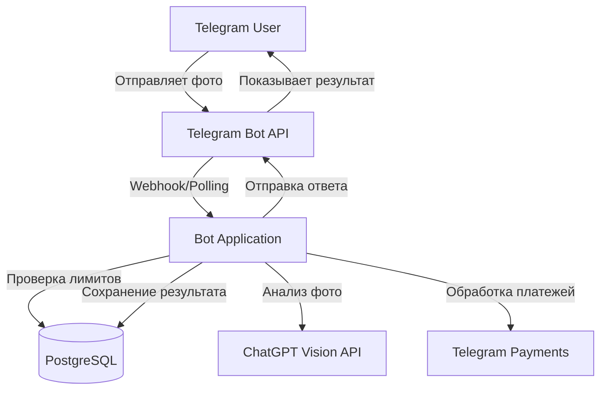
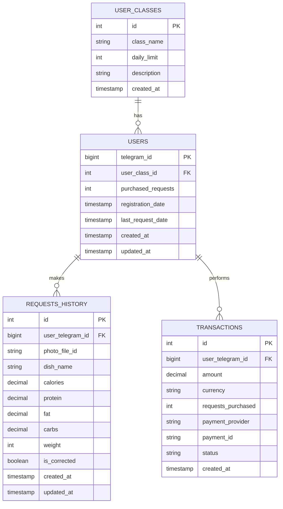

# Design Document

## Overview

Телеграм-бот для подсчета калорий представляет собой Node.js приложение, которое интегрируется с Telegram Bot API, OpenAI ChatGPT Vision API и PostgreSQL базой данных. Архитектура построена на модульном принципе с четким разделением ответственности между компонентами.

Основной поток работы:
1. Пользователь отправляет фото еды в Telegram
2. Бот проверяет лимиты пользователя
3. Отправляет фото в ChatGPT Vision API для анализа
4. Получает и форматирует результат
5. Сохраняет данные в базу
6. Отправляет результат пользователю с возможностью корректировки

## Architecture

### High-Level Architecture



### Technology Stack

- **Runtime**: Node.js (v18+)
- **Language**: JavaScript (ES6+)
- **Telegram Bot Library**: `telegraf` (современная и удобная библиотека)
- **Database**: PostgreSQL (v14+)
- **Database Client**: `pg` (node-postgres)
- **OpenAI Client**: `openai` (официальная библиотека)
- **Environment Variables**: `dotenv`
- **Logging**: `winston`
- **Process Manager**: `pm2` (для деплоя на сервере)

### Project Structure

```
calorie-counter-bot/
├── src/
│   ├── bot/
│   │   ├── index.js              # Инициализация бота
│   │   ├── handlers/
│   │   │   ├── start.js          # Обработчик команды /start
│   │   │   ├── status.js         # Обработчик команды /status
│   │   │   ├── photo.js          # Обработчик фотографий
│   │   │   ├── correction.js     # Обработчик корректировки
│   │   │   └── payment.js        # Обработчик платежей
│   │   └── middleware/
│   │       ├── auth.js           # Регистрация/проверка пользователя
│   │       └── rateLimit.js      # Проверка лимитов
│   ├── services/
│   │   ├── openai.js             # Сервис для работы с OpenAI API
│   │   ├── userService.js        # Логика работы с пользователями
│   │   ├── requestService.js     # Логика работы с запросами
│   │   └── paymentService.js     # Логика обработки платежей
│   ├── database/
│   │   ├── connection.js         # Подключение к БД
│   │   ├── migrations/
│   │   │   └── init.sql          # Начальная миграция
│   │   └── queries/
│   │       ├── users.js          # SQL запросы для пользователей
│   │       ├── requests.js       # SQL запросы для запросов
│   │       └── classes.js        # SQL запросы для классов
│   ├── utils/
│   │   ├── logger.js             # Настройка логирования
│   │   ├── formatter.js          # Форматирование сообщений
│   │   └── validator.js          # Валидация данных
│   └── config/
│       └── constants.js          # Константы приложения
├── .env.example                   # Пример переменных окружения
├── package.json
└── README.md
```

## Components and Interfaces

### 1. Bot Application (src/bot/index.js)

Главный модуль приложения, инициализирует Telegraf бота и регистрирует обработчики.

```javascript
// Основная структура
const { Telegraf } = require('telegraf');
const bot = new Telegraf(process.env.BOT_TOKEN);

// Регистрация middleware
bot.use(authMiddleware);
bot.use(rateLimitMiddleware);

// Регистрация обработчиков команд
bot.command('start', startHandler);
bot.command('status', statusHandler);
bot.on('photo', photoHandler);
bot.on('callback_query', callbackHandler);

// Запуск бота
bot.launch();
```

### 2. Handlers

#### Photo Handler (src/bot/handlers/photo.js)

Обрабатывает входящие фотографии от пользователей.

**Интерфейс:**
```javascript
async function photoHandler(ctx) {
  // ctx.message.photo - массив фотографий разных размеров
  // ctx.message.caption - подпись к фото (может содержать вес)
  // ctx.from.id - telegram_id пользователя
}
```

**Логика:**
1. Вызвать `requestService.canMakeRequest(userId)`
2. Если можно → Извлечь file_id самой большой версии фото, Если нельзя → выдать сообщение о необходимости покупки токенов. Завершить цикл
3. Проверить подпись на наличие веса порции (regex: /\d+/)
4  вызвать `openaiService.analyzeFood(fileId, weight)`
5. Сохранить результат через `requestService.saveRequest()`
6. Отформатировать и отправить ответ с inline-кнопкой "Корректировать"

#### Correction Handler (src/bot/handlers/correction.js)

Обрабатывает корректировку результатов через inline-кнопки.

**Интерфейс:**
```javascript
async function correctionHandler(ctx) {
  // ctx.callbackQuery.data - данные кнопки (например: "edit_calories:123")
  // ctx.callbackQuery.message - исходное сообщение
}
```

**Логика:**
1. Парсить callback_data для определения действия
2. Показать inline-клавиатуру с параметрами (калории, белки, жиры, углеводы)
3. При выборе параметра → запросить новое значение
4. Валидировать введенное значение
5. Обновить запись в БД
6. Обновить сообщение с новыми данными

#### Payment Handler (src/bot/handlers/payment.js)

Обрабатывает покупку дополнительных запросов.

**Интерфейс:**
```javascript
async function paymentHandler(ctx) {
  // Обработка выбора пакета и создания инвойса
  // Обработка успешного платежа
}
```

**Пакеты запросов:**
- 10 запросов - 99 руб
- 50 запросов - 399 руб
- 100 запросов - 699 руб

### 3. Services

#### OpenAI Service (src/services/openai.js)

Взаимодействие с ChatGPT Vision API.

**Интерфейс:**
```javascript
class OpenAIService {
  async analyzeFood(photoUrl, weight = null) {
    // Возвращает: { dishName, calories, protein, fat, carbs }
  }
}
```

**Промпт для ChatGPT:**
```
Проанализируй это изображение еды и предоставь следующую информацию:
1. Название блюда
2. Калорийность (ккал)
3. Белки (г)
4. Жиры (г)
5. Углеводы (г)

${weight ? `Вес порции: ${weight}г. Рассчитай для этого веса.` : 'Определи вес продукта по фото'}

Ответь СТРОГО в формате JSON:
{
  "dishName": "название",
  "calories": число,
  "protein": число,
  "fat": число,
  "carbs": число
}
```

**Обработка ошибок:**
- Таймаут: 30 секунд
- Retry: 2 попытки с экспоненциальной задержкой
- Fallback: сообщение пользователю о временной недоступности

#### User Service (src/services/userService.js)

Управление пользователями и их классами.

**Интерфейс:**
```javascript
class UserService {
  async getOrCreateUser(telegramId) {
    // Возвращает объект пользователя
  }
  
  async getUserClass(userId) {
    // Возвращает информацию о классе пользователя
  }
  
  async updatePurchasedRequests(userId, amount) {
    // Увеличивает количество купленных запросов
  }
  
  async getUserStats(userId) {
    // Возвращает статистику: использованные запросы за день, оставшиеся лимиты
  }
}
```

#### Request Service (src/services/requestService.js)

Управление запросами на анализ.

**Интерфейс:**
```javascript
class RequestService {
  async canMakeRequest(userId) {
    // Проверяет, может ли пользователь сделать запрос
    // Возвращает: { allowed: boolean, reason: string }
  }
  
  async saveRequest(userId, photoFileId, nutritionData, weight) {
    // Сохраняет запрос в БД
    // Возвращает: requestId
  }
  
  async updateRequest(requestId, nutritionData) {
    // Обновляет данные запроса (при корректировке)
  }
  
  async getTodayRequestCount(userId) {
    // Возвращает количество запросов за сегодня
  }
  
  async decrementPurchasedRequest(userId) {
    // Уменьшает счетчик купленных запросов
  }
}
```

**Логика проверки лимитов:**
```javascript
async canMakeRequest(userId) {
  const user = await userService.getOrCreateUser(userId);
  const userClass = await userService.getUserClass(user.user_class_id);
  const todayCount = await this.getTodayRequestCount(userId);
  
  // Если безлимит (PREMIUM/ADMIN)
  if (userClass.daily_limit === null) {
    return { allowed: true };
  }
  
  // Если в пределах дневного лимита
  if (todayCount < userClass.daily_limit) {
    return { allowed: true };
  }
  
  // Если есть купленные запросы
  if (user.purchased_requests > 0) {
    await this.decrementPurchasedRequest(userId);
    return { allowed: true };
  }
  
  // Лимит исчерпан
  return { 
    allowed: false, 
    reason: 'Дневной лимит исчерпан. Купите дополнительные запросы.' 
  };
}
```

### 4. Database Layer

#### Connection (src/database/connection.js)

Управление подключением к PostgreSQL.

```javascript
const { Pool } = require('pg');

const pool = new Pool({
  host: process.env.DB_HOST,
  port: process.env.DB_PORT,
  database: process.env.DB_NAME,
  user: process.env.DB_USER,
  password: process.env.DB_PASSWORD,
  max: 20,
  idleTimeoutMillis: 30000,
  connectionTimeoutMillis: 2000,
});

// Обработка ошибок подключения
pool.on('error', (err) => {
  logger.error('Unexpected database error', err);
});

module.exports = pool;
```

## Data Models

### Database Schema

```sql
-- Таблица классов пользователей
CREATE TABLE user_classes (
  id SERIAL PRIMARY KEY,
  class_name VARCHAR(50) UNIQUE NOT NULL,
  daily_limit INTEGER,  -- NULL означает безлимит
  description TEXT,
  created_at TIMESTAMP DEFAULT CURRENT_TIMESTAMP
);

-- Начальные данные
INSERT INTO user_classes (class_name, daily_limit, description) VALUES
  ('FREE', 1, 'Бесплатный класс с 1 запросом в день'),
  ('PREMIUM', NULL, 'Премиум подписка с безлимитными запросами'),
  ('ADMIN', NULL, 'Административный доступ');

-- Таблица пользователей
CREATE TABLE users (
  telegram_id BIGINT PRIMARY KEY,
  user_class_id INTEGER REFERENCES user_classes(id) DEFAULT 1,
  purchased_requests INTEGER DEFAULT 0,
  registration_date TIMESTAMP DEFAULT CURRENT_TIMESTAMP,
  last_request_date TIMESTAMP,
  created_at TIMESTAMP DEFAULT CURRENT_TIMESTAMP,
  updated_at TIMESTAMP DEFAULT CURRENT_TIMESTAMP
);

-- Индекс для быстрого поиска по классу
CREATE INDEX idx_users_class ON users(user_class_id);

-- Таблица истории запросов
CREATE TABLE requests_history (
  id SERIAL PRIMARY KEY,
  user_telegram_id BIGINT REFERENCES users(telegram_id) ON DELETE CASCADE,
  photo_file_id VARCHAR(255) NOT NULL,
  dish_name VARCHAR(255),
  calories DECIMAL(10, 2),
  protein DECIMAL(10, 2),
  fat DECIMAL(10, 2),
  carbs DECIMAL(10, 2),
  weight INTEGER,  -- вес порции в граммах
  is_corrected BOOLEAN DEFAULT FALSE,
  created_at TIMESTAMP DEFAULT CURRENT_TIMESTAMP,
  updated_at TIMESTAMP DEFAULT CURRENT_TIMESTAMP
);

-- Индексы для оптимизации запросов
CREATE INDEX idx_requests_user_date ON requests_history(user_telegram_id, created_at);
CREATE INDEX idx_requests_created_at ON requests_history(created_at);

-- Таблица транзакций (для будущего расширения)
CREATE TABLE transactions (
  id SERIAL PRIMARY KEY,
  user_telegram_id BIGINT REFERENCES users(telegram_id),
  amount DECIMAL(10, 2) NOT NULL,
  currency VARCHAR(3) DEFAULT 'RUB',
  requests_purchased INTEGER NOT NULL,
  payment_provider VARCHAR(50),
  payment_id VARCHAR(255),
  status VARCHAR(50) DEFAULT 'pending',
  created_at TIMESTAMP DEFAULT CURRENT_TIMESTAMP
);

-- Индекс для поиска транзакций пользователя
CREATE INDEX idx_transactions_user ON transactions(user_telegram_id);
```

### Entity Relationships



## Error Handling

### Error Categories

1. **User Errors** (4xx)
   - Недостаточно запросов
   - Невалидный ввод при корректировке
   - Отмена платежа

2. **System Errors** (5xx)
   - Ошибка OpenAI API
   - Ошибка подключения к БД
   - Таймаут запроса

3. **Network Errors**
   - Потеря соединения с Telegram
   - Потеря соединения с OpenAI

### Error Handling Strategy

```javascript
// Централизованный обработчик ошибок
class ErrorHandler {
  static async handle(error, ctx) {
    logger.error('Error occurred', {
      error: error.message,
      stack: error.stack,
      userId: ctx.from?.id,
      updateType: ctx.updateType
    });
    
    if (error instanceof UserError) {
      await ctx.reply(error.message);
    } else if (error instanceof APIError) {
      await ctx.reply('⚠️ Сервис временно недоступен. Попробуйте позже.');
    } else if (error instanceof DatabaseError) {
      await ctx.reply('⚠️ Ошибка сохранения данных. Попробуйте позже.');
      // Уведомить администратора
    } else {
      await ctx.reply('⚠️ Произошла ошибка. Попробуйте позже.');
    }
  }
}

// Использование в боте
bot.catch(ErrorHandler.handle);
```

### Retry Logic

Для OpenAI API:
```javascript
async function retryWithBackoff(fn, maxRetries = 2) {
  for (let i = 0; i < maxRetries; i++) {
    try {
      return await fn();
    } catch (error) {
      if (i === maxRetries - 1) throw error;
      await sleep(Math.pow(2, i) * 1000); // 1s, 2s, 4s...
    }
  }
}
```

## Testing Strategy

### Unit Tests

Тестирование отдельных модулей с моками зависимостей.

**Приоритетные модули для тестирования:**
- `services/requestService.js` - логика проверки лимитов
- `services/userService.js` - создание и управление пользователями
- `utils/validator.js` - валидация входных данных
- `utils/formatter.js` - форматирование сообщений

**Инструменты:**
- Test Framework: `jest`
- Mocking: `jest.mock()`

**Пример теста:**
```javascript
describe('RequestService', () => {
  describe('canMakeRequest', () => {
    it('should allow request for FREE user within daily limit', async () => {
      // Arrange
      const userId = 123456;
      mockUserService.getOrCreateUser.mockResolvedValue({
        telegram_id: userId,
        user_class_id: 1,
        purchased_requests: 0
      });
      mockUserService.getUserClass.mockResolvedValue({
        class_name: 'FREE',
        daily_limit: 1
      });
      mockGetTodayRequestCount.mockResolvedValue(0);
      
      // Act
      const result = await requestService.canMakeRequest(userId);
      
      // Assert
      expect(result.allowed).toBe(true);
    });
  });
});
```

### Integration Tests

Тестирование взаимодействия компонентов с реальной тестовой БД.

**Сценарии:**
- Полный цикл: регистрация → отправка фото → получение результата
- Проверка лимитов: исчерпание дневного лимита → использование купленных запросов
- Корректировка результатов: изменение калорий → сохранение в БД

### Manual Testing Checklist

- [ ] Отправка фото без подписи
- [ ] Отправка фото с весом в подписи
- [ ] Корректировка каждого параметра (калории, белки, жиры, углеводы)
- [ ] Достижение дневного лимита
- [ ] Покупка запросов через Telegram Payments
- [ ] Команда /status для разных классов пользователей
- [ ] Обработка некорректного ввода при корректировке
- [ ] Поведение при недоступности OpenAI API

## Configuration

### Environment Variables

```bash
# Telegram Bot
BOT_TOKEN=your_telegram_bot_token

# OpenAI
OPENAI_API_KEY=your_openai_api_key
OPENAI_MODEL=gpt-4-vision-preview

# Database
DB_HOST=localhost
DB_PORT=5432
DB_NAME=calorie_bot
DB_USER=postgres
DB_PASSWORD=your_password

# Telegram Payments
PAYMENT_PROVIDER_TOKEN=your_payment_token

# Application
NODE_ENV=production
LOG_LEVEL=info
PORT=3000
```

### Constants (src/config/constants.js)

```javascript
module.exports = {
  USER_CLASSES: {
    FREE: 1,
    PREMIUM: 2,
    ADMIN: 3
  },
  
  PAYMENT_PACKAGES: [
    { requests: 10, price: 99, currency: 'RUB' },
    { requests: 50, price: 399, currency: 'RUB' },
    { requests: 100, price: 699, currency: 'RUB' }
  ],
  
  OPENAI: {
    TIMEOUT: 30000,
    MAX_RETRIES: 2
  },
  
  MESSAGES: {
    WELCOME: '👋 Привет! Отправь мне фото еды, и я подсчитаю калории.',
    LIMIT_REACHED: '⚠️ Дневной лимит исчерпан. Купите дополнительные запросы.',
    PROCESSING: '⏳ Анализирую фото...',
    ERROR: '⚠️ Произошла ошибка. Попробуйте позже.'
  }
};
```

## Deployment

### Server Setup

1. Установить Node.js v18+
2. Установить PostgreSQL v14+
3. Установить PM2: `npm install -g pm2`
4. Клонировать репозиторий
5. Установить зависимости: `npm install`
6. Настроить `.env` файл
7. Запустить миграции БД: `npm run migrate`
8. Запустить бота: `pm2 start src/bot/index.js --name calorie-bot`

### PM2 Configuration

```javascript
// ecosystem.config.js
module.exports = {
  apps: [{
    name: 'calorie-bot',
    script: './src/bot/index.js',
    instances: 1,
    autorestart: true,
    watch: false,
    max_memory_restart: '1G',
    env: {
      NODE_ENV: 'production'
    },
    error_file: './logs/err.log',
    out_file: './logs/out.log',
    log_file: './logs/combined.log',
    time: true
  }]
};
```

### Monitoring

- Логи: `pm2 logs calorie-bot`
- Статус: `pm2 status`
- Мониторинг: `pm2 monit`

## Security Considerations

1. **API Keys**: Хранить в переменных окружения, никогда не коммитить в Git
2. **Database**: Использовать параметризованные запросы для предотвращения SQL injection
3. **Rate Limiting**: Реализовано через систему классов и лимитов
4. **Input Validation**: Валидировать все пользовательские вводы
5. **Error Messages**: Не раскрывать внутренние детали системы в сообщениях об ошибках

## Future Enhancements

Функции, которые будут добавлены после MVP:

1. **История питания**
   - Просмотр всех запросов пользователя
   - Фильтрация по датам
   - Экспорт данных

2. **Статистика и аналитика**
   - Дневной/недельный/месячный отчет
   - Графики потребления калорий
   - Анализ макронутриентов

3. **Цели и трекинг**
   - Установка целей по калориям
   - Прогресс к цели
   - Уведомления

4. **База данных блюд**
   - Быстрое добавление популярных блюд без фото
   - Поиск по названию
   - Избранные блюда

5. **Премиум подписка**
   - Автоматическое продление
   - Расширенная статистика
   - Приоритетная обработка
